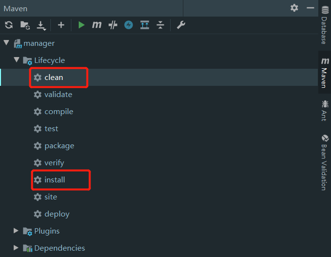
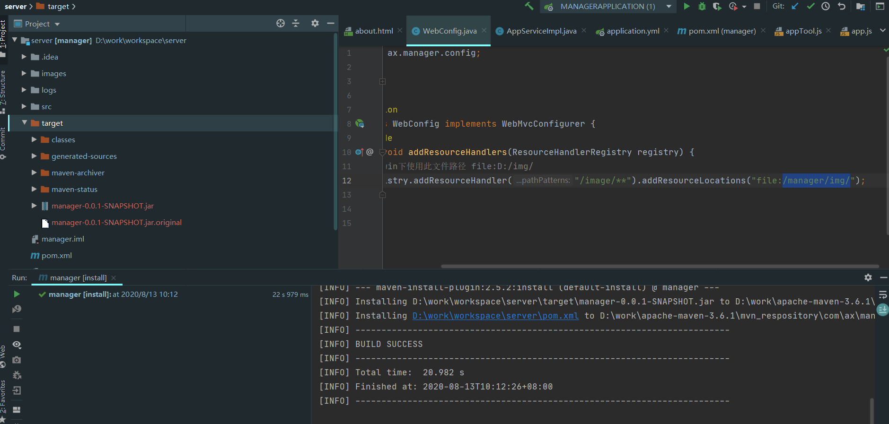

# 后台管理系统 & 系统集成门户
## SpringBoot+Layui
## 项目介绍
> 后台管理系统 & 系统集成门户是一体化的，门户主要用于放置应用进行一站式访问

> 后台管理系统是为了控制门户可以展示哪些应用，从而形成门户+管理

## 后端
SpringBoot  2.1.0  
tk.mybatis  2.0.2  
Shiro  1.3.1  
Lombok 1.18.4  

## 前端
Layui  2.4.5  
JQuery  3.3.1

## 数据库
MariaDB-5.5.65
数据结构存放于码云 server/main/resources/sql 中 

## 渲染模板
Thymeleaf

## 运行环境
jdk1.8

## 项目编译部署
使用idea进行编译，clean清除残留包，install开始编译程序

编译后的java程序包在target项目文件夹中

> 在部署前创建 mkdir manager 和 mkdir manager/img
> 
> 打包好的程序与外部的yml文件放到manage文件夹中
> 
> img文件夹为图片文件存放位置
> 
> 如果部署，yml配置文件需要更改为线上的数据源

## 启动服务
后台启动：java -jar manager-0.0.1-SNAPSHOT.jar --spring.config.location=application.yml &
启动后会自动在当前目录创建一个logs文件夹存放运行日志
